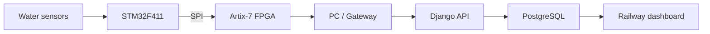

# aqua_iceeis26

Django monitoring and experiment logging for **FPGA-Accelerated Edge Denoising of High-Frequency Water-Quality Sensor Data for Aquaculture Monitoring**, IEEE ICEEIS 2026.

> Demonstration datasets included with the software are SIMULATED and must not be interpreted as measured FPGA or sensor results.

The FPGA's robust adaptive denoising is the research contribution. This repository provides reproducible experiment logging, validation, analysis and publication exports around that hardware pipeline.



Channels are DO (mg/L), pH, TDS (ppm), and temperature (°C). Raw values are required for valid packets; FPGA-filtered values, latency, cycle count, noise estimate, threshold, alpha and detector flags are recorded when supplied. Extra sensors can be preserved in JSON. Experiment types include SYNTHETIC, STABLE, INTERVENTION, IMPULSE, MIXED_NOISE, HIL, REAL_WORLD, CALIBRATION and OTHER. The independent provenance field distinguishes REAL, HIL, SYNTHETIC and SIMULATED.

## Release reproducibility and integrity

Run metadata includes optional sampling/clock frequency; input/output/accumulator/coefficient Q-formats; rounding and saturation modes; stable/normal/noisy/transient alpha, noise beta, threshold parameters, median window and persistence count; software/FPGA/STM32/gateway Git commits; instrument, calibration, sensor-model and notes fields. Existing runs remain valid with empty optional fields. Enter real configuration through Admin or the run API; fields are included in canonical exports.

Use the lifecycle CREATED → RUNNING → COMPLETED → LOCKED. PATCH the run to RUNNING/COMPLETED, then POST `/api/v1/runs/<id>/lock/`. Locking creates integrity hashes atomically and prevents ordinary API, admin and guarded ORM modification of the run, samples, references, events and shared FPGA implementation. Only a logged-in superuser may POST `/api/v1/runs/<id>/unlock/` with `{"reason":"Documented correction reason"}` or use the protected Admin action. Unlock history preserves prior digests. Bearer tokens cannot unlock. Existing acquisition workflows may still append to unlocked CREATED/COMPLETED runs; locking establishes the immutable boundary.

GET `/api/v1/runs/<id>/research-package/` downloads a finalized run's ZIP. Authenticated POST to the same URL records the generated hashes for a COMPLETED run. A locked download verifies stored hashes and refuses mismatches. The existing UI exposes **Research ZIP** and staff lock actions.

Packages contain `samples.csv`, `events.csv`, `metadata.json`, `metrics.json`, `fpga_config.json`, tables A–E as separate CSVs, `SHA256SUMS.txt`, and `README.txt`. When present, independent HIL references are included as `hil_references.csv`. Every package preserves provenance. Canonical ordering, JSON/CSV formatting and fixed ZIP metadata make repeated exports of unchanged evidence identical. `dataset_sha256` hashes samples.csv; `research_package_sha256` hashes the ZIP. Hash bookkeeping fields are excluded to avoid circularity; lifecycle provenance is included. See [integrity contract](docs/RESEARCH_INTEGRITY.md).

## HIL sequence alignment

POST an object or array to `/api/v1/runs/<id>/hil-references/` for an HIL/SYNTHETIC/SIMULATED run:

```json
{"sensor":"do","sequence_number":42,"software_reference":6.25,"software_integer_code":1600,"reference_source":"Versioned software model"}
```

The corresponding packet supplies `sequence_number`, `do_filtered` (FPGA output), and optionally `do_fpga_code`. Matching uses run + sensor + sequence, independent of timestamp. Duplicate reference keys are rejected atomically. Repeated packet sequences are ambiguous and excluded instead of silently choosing one. Summary reports paired/unmatched samples, ambiguous sequences, MAE/MSE/RMSE/max error and integer-code agreement. Float equality never establishes bit-exact agreement. These software outputs are distinct from sensor/reference-meter ground truth.

See [gateway HTTP protocol](docs/GATEWAY_PROTOCOL.md) for all fields, units, authenticated single/batch uploads, retries and sequence rules. Recommended batch size is 50–200 samples when appropriate; no speculative serial protocol is defined.

The data path is sensors → STM32F411 → SPI → Artix-7/Basys 3 → PC/gateway → authenticated HTTP ingestion → Django/PostgreSQL. The server records supplied FPGA outputs; it does not implement or verify the physical FPGA pipeline. Simulated runs are explicitly labelled and are not research evidence.

## Run locally on Windows

Use Python 3.12 or newer. From this directory in PowerShell:

```powershell
py -m venv .venv
& .\.venv\Scripts\python.exe -m pip install -r requirements.txt
$env:DEBUG = 'true'
$env:ALLOWED_HOSTS = 'localhost,127.0.0.1'
$env:INGEST_API_TOKEN = (& .\.venv\Scripts\python.exe -c 'import secrets; print(secrets.token_urlsafe(48))').Trim()
& .\.venv\Scripts\python.exe manage.py migrate
& .\.venv\Scripts\python.exe manage.py createsuperuser
& .\.venv\Scripts\python.exe manage.py simulate_sensor --count 1000 --seed 2026
& .\.venv\Scripts\python.exe manage.py runserver 127.0.0.1:8000
```

Open <http://127.0.0.1:8000/> and use `/admin/` to sign in. Existing environments can skip creation and installation. Keep the environment variables in the same PowerShell session as `runserver`; `.env.example` is a reference template, and `.env` is **not automatically loaded**. Without `DATABASE_URL`, local development uses `db.sqlite3`. `DEBUG` defaults to false, and production settings require a random `SECRET_KEY` of at least 50 characters.

The simulation command creates a separate `SIMULATED` experiment on each invocation and is disabled when `DEBUG=false`. A completed replay can correctly appear offline after `SENSOR_OFFLINE_SECONDS` (default 30): online status means a recently received packet, not webserver availability.

Run validation separately:

```powershell
$env:DEBUG = 'true'
& .\.venv\Scripts\python.exe manage.py check
& .\.venv\Scripts\python.exe manage.py makemigrations --check --dry-run
& .\.venv\Scripts\python.exe manage.py migrate --noinput
& .\.venv\Scripts\python.exe manage.py collectstatic --noinput
& .\.venv\Scripts\python.exe manage.py test
```

## Pages and access

| Page | Purpose |
| --- | --- |
| `/` | Current sensor values, per-sensor health, packet counts and live charts |
| `/runs/` | Experiment catalogue, staff creation and CSV import |
| `/runs/<id>/` | Run metadata, charts, analysis and downloads |
| `/live/` | Automatically updated sensor and diagnostic plots |
| `/analysis/` | Dispersion, reference error, SNR, outlier, transient and fixed-point metrics |
| `/compare/` | Comparison of 2–5 selected runs and filter versions |
| `/fpga/` | Measured runtime and supplied synthesis/resource values |
| `/events/` | Quality events and manually supplied STEP markers |
| `/paper/`, `/runs/<id>/paper/` | Scientific figures, tables A–E, PNG downloads and print/PDF layout |
| `/system/` | Database/server status, latest packets, active run and configured version |
| `/admin/` | Authenticated metadata, synthesis, event and record management |

Read APIs and dashboard pages are public. Writes require either `Authorization: Bearer <INGEST_API_TOKEN>` or a logged-in Django **staff** session with a valid CSRF token. An unset token disables Bearer writes. The shared token permits all implemented API writes, including run, event and synthesis creation; use a gateway credential with that scope in mind. Deletion is available only through Django admin permissions. No default account or password is created.

## API contract

All paths below end in `/`. Send `Content-Type: application/json` for JSON writes. Successful creation returns HTTP 201; malformed requests return validation errors. GET collections return bounded `results` lists and a total `count`. Samples are retained, including repeated sequence numbers and packets explicitly marked invalid, so communication analysis can examine them.

| Method | Endpoint | Result |
| --- | --- | --- |
| POST | `/api/v1/samples/` | Insert one sample; returns `created` and `ids` |
| POST | `/api/v1/samples/batch/` | Atomically validate and bulk insert 1–5,000 samples |
| GET | `/api/v1/latest/` | Latest sample by server receipt order and individual sensor health |
| GET | `/api/v1/history/` | Sample history with pagination/downsampling |
| GET, POST | `/api/v1/runs/` | List/create experiments |
| GET, PATCH | `/api/v1/runs/<id>/` | Read/update run metadata |
| GET | `/api/v1/runs/<id>/samples/` | Run-scoped sample history |
| GET | `/api/v1/runs/<id>/stats/`, `/summary/` | Same full scientific summary |
| GET | `/api/v1/runs/<id>/export/` | Streaming UTF-8 sample CSV |
| POST | `/api/v1/runs/<id>/import/` | Multipart CSV import and per-row report |
| GET | `/api/v1/runs/<id>/tables/` | Tables A–E; add `?download=csv` for CSV |
| GET, POST | `/api/v1/implementations/` | List/create FPGA synthesis records |
| GET, POST | `/api/v1/events/` | List/create quality or ground-truth event records |
| GET | `/api/v1/status/` | System and packet status without secrets |
| GET | `/health/` | Database readiness: HTTP 200 when available, 503 on database error |

History/sample filters: `run_id`, timezone-qualified ISO 8601 `start` and `end` (inclusive), `quality_flag`, `state`, `sensor=do|ph|tds|temperature`, `limit` (default 500, maximum 5,000), and `page`. Pages select the most recent samples first, with returned rows ordered chronologically. `sensor` narrows returned channel fields. `downsample=<target>` selects an approximately even subset across the matching interval (at most 5,000 rows), rather than averaging measurements; brief spikes can be omitted. Always use original data for analysis and publication claims.

Summary endpoints accept sample filters, including start/end windows; metrics use matching original samples rather than chart downsampling. Runs list at most 500 per API page. Events and implementations list at most 1,000 per API page. Events support `run_id` and `event_type` filters.

### Create a run and send a sample

Example PowerShell request using the token set in the local startup session:

```powershell
$headers = @{ Authorization = "Bearer $env:INGEST_API_TOKEN" }
$body = @{
    run_name = 'DO and pH bench acquisition'
    run_type = 'REAL_WORLD'
    source = 'REAL'
    status = 'RUNNING'
    filter_version = 'Proposed Robust Adaptive Median-IIR'
    fpga_bitstream_version = 'record-your-bitstream-version'
    firmware_version = 'record-your-firmware-version'
} | ConvertTo-Json
$run = Invoke-RestMethod -Method Post -Uri 'http://127.0.0.1:8000/api/v1/runs/' -Headers $headers -ContentType 'application/json' -Body $body
```

The following JSON illustrates the gateway schema; the numbers are examples, not measured results. Replace `run_id` with the created ID and transmit actual values:

```json
{
  "run_id": 12,
  "timestamp": "2026-09-09T10:20:30.123Z",
  "sequence_number": 15234,
  "do_raw": 6.72,
  "do_filtered": 6.65,
  "ph_raw": 7.43,
  "ph_filtered": 7.39,
  "tds_raw": 420.5,
  "temperature_raw": 27.6,
  "fpga_latency_us": 1.24,
  "signal_state": "STABLE",
  "quality_flag": "NORMAL",
  "outlier_detected": false,
  "transient_detected": false,
  "noise_estimate": 0.034,
  "adaptive_threshold": 0.12,
  "alpha_value": 0.0625,
  "packet_valid": true,
  "sensor_status": {"do": "OK", "ph": "OK", "tds": "OK", "temperature": "OK"}
}
```

For a valid packet, `run_id`, `do_raw`, `ph_raw`, `tds_raw`, and `temperature_raw` are required. Filtered channels, latency, diagnostics, references, sequence and CRC are optional; no FPGA latency or filtered output is inferred. Supply `packet_valid=false` to record an invalid packet even when raw fields cannot be decoded. Missing timestamp defaults to server time, so a gateway should explicitly send its acquisition timestamp for high-rate experiments. `received_at` records ingestion time independently.

Batch bodies may be a JSON array or `{"samples": [...]}`. Validation of any entry fails the entire batch without inserting part of it. Source defaults to the run source and must match it. A run's source cannot change after data have been logged through the API. Treat a sequence reset/wrap or different device as a new run when interpreting sequence metrics.

Run types: `SYNTHETIC`, `STABLE`, `INTERVENTION`, `IMPULSE`, `MIXED_NOISE`, `HIL`, `REAL_WORLD`, `CALIBRATION`, `OTHER`. Sources: `REAL`, `SIMULATED`, `HIL`, `SYNTHETIC`. Statuses: `CREATED`, `RUNNING`, `COMPLETED`, `LOCKED`, `FAILED`.

Quality flags: `NORMAL`, `SPIKE`, `OUT_OF_RANGE`, `SENSOR_FAULT`, `TRANSIENT`, `NOISY`. Signal states: `STABLE`, `NORMAL`, `NOISY`, `TRANSIENT`, `OUTLIER`, `UNKNOWN`. Per-sensor health values: `OK`, `NOISY`, `OUTLIER`, `OUT_OF_RANGE`, `SENSOR_FAULT`, `OFFLINE`.

Store instrument validity limits in `sensor_configuration.validity_ranges`, e.g. `{"ph": [0, 14]}` only if that range matches your instrument. These are acquisition validity limits, not universal biological recommendations. Additional channel payloads can be preserved in `extra_sensors`; adding their charts/analysis requires frontend/analysis registration.

### References and fixed-point evidence

Each of DO, pH, TDS and temperature supports distinct optional fields:

| Field pattern | Meaning |
| --- | --- |
| `<sensor>_reference` | Clean synthetic or independent sensor/reference-meter value |
| `<sensor>_software_reference` | Software algorithm output expected from FPGA processing |
| `<sensor>_fpga_code`, `<sensor>_software_code` | Integer codes in identical fixed-point representation for bit-exact comparison |
| `reference_timestamp`, `reference_source` | Reference acquisition time and provenance |

Join references to the correct sample in the gateway/import preparation step. Metrics compare fields **on the same row**; the server does not resample or time-align external meter logs merely because `reference_timestamp` is present. Record units, calibration, clock alignment, software version, Q-format, scaling, rounding and saturation rules in run metadata/notes. Float equality is not labelled bit-exact agreement.

`ground_truth_spike` is an optional true spike label. `outlier_detected` records the FPGA detector decision. `spike_removed` is a separately supplied observed removal result used for rejection/false-removal rates; detection alone does not prove removal.

### STEP events and synthesis inputs

POST to `/api/v1/events/` with a known event time and explicit response definition:

```json
{
  "run": 12,
  "timestamp": "2026-09-09T10:20:31.000Z",
  "sensor": "do",
  "event_type": "STEP",
  "metadata": {
    "initial": 6.0,
    "target": 7.0,
    "settling_band": 0.02,
    "hold_seconds": 1.0
  }
}
```

This is a schema example. `settling_band` is an absolute tolerance in channel units, and `hold_seconds` is the required observed in-band duration. Both must be positive. Do not infer an unknown intervention time from a convenient chart feature. Events use `run`, while sensor ingestion uses `run_id`.

Create an FPGA implementation in Admin or POST `/api/v1/implementations/` using `name`, `report_source`, and any available real `clock_mhz`, `max_clock_mhz`, `timing_slack_ns`, `power_w`, and `{lut,ff,dsp,bram}_{used,available}` values. Attach its ID through the run's `implementation` field. Omit unavailable values. Resource percentages require both used and available values; theoretical latency requires a positive clock frequency and supplied sample `fpga_cycles`. No Vivado results are seeded.

### CSV import/export

Staff can upload CSV on Experiments or a run detail page. The API accepts multipart fields `file` and optional `mapping`, a JSON object mapping **CSV column name → model field**, such as `{"DO_mgL":"do_raw","pH_meter":"ph_reference"}`. UTF-8/BOM files are supported. Match the sample payload field names directly when no mapping is needed.

Uploads are limited to 10 MB and 20,000 data rows. A valid packet still requires four raw channels. Blank optional cells become absent fields. JSON cells such as `sensor_status` or `extra_sensors` must contain valid quoted CSV/JSON. Example PowerShell 7 upload:

```powershell
Invoke-RestMethod -Method Post -Uri "http://127.0.0.1:8000/api/v1/runs/$($run.id)/import/" -Headers $headers -Form @{
    file = Get-Item -LiteralPath '.\experiment.csv'
    mapping = '{"DO_mgL":"do_raw"}'
}
```

Ordinary row validation errors produce an explicit partial-import report with `total_rows`, `successful_rows`, `failed_rows`, `missing_columns` and `conversion_errors` with row numbers. Valid rows are committed together. A file-level parsing/size/row-limit failure imports no rows. Inspect the report before retrying: re-importing successful rows produces new records, and ingestion does not silently deduplicate experimental evidence.

CSV export streams all sample model fields, including reference/code/provenance fields and JSON metadata, ordered by sample timestamp. UTF-8 output includes a BOM for spreadsheet compatibility. Text that could become a spreadsheet formula is escaped. Table CSV includes source labels and `N/A` for undefined metrics.

## Scientific conventions

Signal metrics exclude rows where `packet_valid=false` or `packet_crc_ok=false`; communication counts retain those rows. Missing values remain null (`N/A` in the UI).

| Metric | Definition and prerequisites |
| --- | --- |
| Basic statistics | N, mean, min/max, range, population SD/variance (`ddof=0`), median, unscaled median absolute deviation, RMS, and CV = `100 × SD / abs(mean)`; CV is null for zero mean |
| Noise reductions | `100 × (raw − filtered) / raw` for SD, MAD and peak-to-peak, on the same raw/filtered sample pairs; null for a zero raw baseline |
| MAE, MSE, RMSE | Errors against supplied aligned sensor reference values; reduction compares common raw/filtered/reference triples |
| SNR | `10 log10(mean(reference²) / mean((observed − reference)²))`, including DC; reports the definition and matched count; zero signal or error power gives null instead of an artificial finite dB value |
| Outlier metrics | Confusion counts, precision, recall and F1 only on rows with true labels; absent labels leave only detected count/rate; undefined denominators remain null |
| Removal rates | Fractions in `[0,1]` from supplied `spike_removed` and true labels; precision, recall and F1 are also fractions |
| Fixed-point | Numeric MAE/RMSE/max error against software output; relative error excludes zero references; bit-exact agreement only from paired integer codes |
| Transient response | Known STEP marker; first reported transient flag after the event for response delay; 10–90% rise/fall; overshoot relative to step amplitude; settling and steady-state error require the declared in-band hold duration |
| Latency | Only supplied valid-packet measurements; current, mean, min/max, and linearly interpolated P50/P95/P99 |
| Throughput | `(N − 1) / (last sample time − first sample time)` for observed valid sample timestamps; this is the acquisition rate, not measured FPGA maximum capacity |
| Communication | Success = valid received packets / all received packets; duplicate and out-of-order counts follow receipt order; gaps are absent sequence IDs inside observed min/max, not proven packet loss; dropped packets remain null |

Whole-run summaries use a short, process-local cache. Analysis is bounded by `ANALYSIS_MAX_SAMPLES` (default 200,000); choose `start`/`end` on the summary API for larger experiments. No background computation queue or materialized summary database is configured. Indexed run/timestamp and run/sequence fields, bounded chart queries, bulk inserts, and streaming export support practical experimental datasets; target-rate capacity still needs a deployment-specific load test.

Paper view preserves experiment source labels. PNG filenames identify the run/source, and figures include source captions. Publish only figures backed by actual experiments, with the acquisition and reference definitions reported alongside them.

## Railway deployment

**Deployed:** [production dashboard](https://aquaiceeis26-production.up.railway.app) with Railway PostgreSQL. See [final release results](FINAL_RELEASE_REPORT.md) and [deployment evidence](RAILWAY_DEPLOYMENT_REPORT.md). The Docker image uses Python 3.12, a non-root application user, Gunicorn and WhiteNoise. Application dependencies are pinned to the installed direct-package versions; transitive dependencies and the base image are not fully locked.

Railway's legacy configuration file is retained only as `docs/railway.legacy.json`. New deployments use actual service settings from `docs/railway-service-settings.json`, applied through the supported Railway public API (`scripts/configure_railway.graphql`) or the dashboard. This release applies service settings directly; the archived example is not loaded at runtime. See [Railway configuration documentation](https://docs.railway.com/config-as-code).

1. Create a Railway project with a PostgreSQL service and this repository as a web service. Set the repository root containing `Dockerfile` as the service root and use Dockerfile build detection.
2. Generate a public web domain. Configure the web service variables shown below. Replace the database service name `Postgres` if yours differs.
3. Set **Pre-deploy command** to `python manage.py migrate --noinput`.
4. Leave the start command empty to use the Dockerfile's command. It collects static files and then binds Gunicorn to `0.0.0.0:$PORT`.
5. Set healthcheck path `/health/`, timeout 120 seconds, and restart policy on failure with 3 retries.
6. Deploy, inspect migration/start logs, and verify `/health/`, `/`, `/api/v1/status/`, and static asset responses on the actual HTTPS domain. Create a staff account with `python manage.py createsuperuser` in an authenticated Railway service shell.
7. Configure database backups and verify a restore procedure for the experiment records. Point the gateway at the HTTPS ingestion endpoint with its configured token.

| Web-service variable | Value |
| --- | --- |
| `DEBUG` | `false` |
| `SECRET_KEY` | A unique random secret of at least 50 characters |
| `INGEST_API_TOKEN` | A separate random gateway token |
| `DATABASE_URL` | `${{Postgres.DATABASE_URL}}` |
| `ALLOWED_HOSTS` | `your-service.up.railway.app,healthcheck.railway.app` plus any custom hostname |
| `CSRF_TRUSTED_ORIGINS` | `https://your-service.up.railway.app` plus any custom HTTPS origin, comma-separated |
| `SECURE_SSL_REDIRECT` | `true` |
| `SOFTWARE_VERSION` | Release/commit identifier, optionally `${{RAILWAY_GIT_COMMIT_SHA}}` |
| `SENSOR_OFFLINE_SECONDS` | Optional; default `30` |
| `ANALYSIS_MAX_SAMPLES` | Optional; default `200000`, size for available memory |

Railway injects `PORT`. Its health checker uses host `healthcheck.railway.app`, so include that hostname in `ALLOWED_HOSTS`; `/health/` is exempt from HTTPS redirects. Railway's configured check gates deployment readiness rather than continuously monitoring the running service. See [Railway health checks](https://docs.railway.com/guides/healthchecks).

Migrations use PostgreSQL during pre-deploy. Static collection stays in the application start command because Railway pre-deploy filesystem changes do not persist to the running container. See [Railway pre-deploy execution](https://docs.railway.com/guides/pre-deploy-command). Cross-service variable syntax is documented in [Railway variables](https://docs.railway.com/reference/variables).

Do not use ephemeral container SQLite for production records. Production settings require secure cookies, HTTPS redirection, a strong secret and PostgreSQL when running on Railway. The release reports record the actual deployment and database/HTTP verification; rerun those checks after configuration changes.

## Inputs still needed from the experiment

- Actual STM32/gateway packet format, device clock synchronization, sequence width/reset rules and measured ingestion rate. No serial or MQTT gateway adapter is supplied because no existing adapter/protocol was present.
- Measured DO/pH raw and FPGA outputs; TDS/temperature raw data; actual latency/cycle measurements and filter state semantics.
- Reference-meter calibration and sample alignment, or declared synthetic clean reference data.
- True spike labels and independently assessed removal outcomes for detector/rejection evaluation.
- Known intervention times and predefined settling band/hold interval for dynamic claims.
- Matched software/FPGA fixed-point outputs, integer codes and complete numeric-format settings.
- Vivado utilization/timing/power reports and bitstream/firmware/software version provenance.

See `WEB_SERVER_IMPLEMENTATION_REPORT.md` and `WEB_SERVER_TEST_REPORT.md` for implementation and executed validation evidence.

## Final release verification

The original reports document the first 47-test milestone. `FINAL_RELEASE_REPORT.md` and `RAILWAY_DEPLOYMENT_REPORT.md` record the final release and actual deployment outcome; treat them as authoritative for current status.

```powershell
$env:INGEST_API_TOKEN = 'your-configured-local-or-remote-token'
& .\.venv\Scripts\python.exe scripts/verify_release.py --base-url http://127.0.0.1:8000 --counts 1000 10000 50000 --output-dir evidence/local-release
& .\.venv\Scripts\python.exe scripts/verify_browser.py --base-url http://127.0.0.1:8000 --run-ids 3 4 5 --output-dir evidence/local-release/browser
```

Replace the run IDs with those actually created by the driver. It creates only new SIMULATED experiments, measures application HTTP timings, verifies all exports/hashes, locks its runs and checks mutation rejection. Browser tooling is optional: `pip install playwright==1.62.0` and `python -m playwright install chromium`. Generated ZIP/PDF/CSV, databases, environments, logs and local tokens are excluded from Git. Intentional source-labelled screenshots and sanitized JSON reports may be retained.

GitHub Actions `.github/workflows/verify.yml` runs the Django suite on PostgreSQL and builds/runs an actual Linux Gunicorn container. A configured workflow is not a PASS claim; final reports cite its executed outcome.
